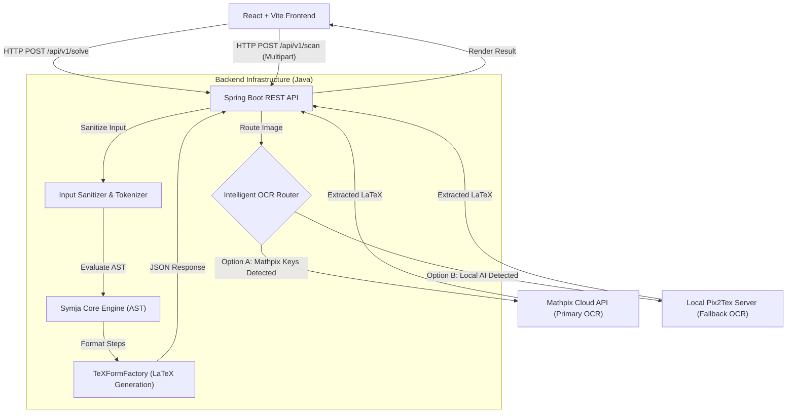

# mycalc - Advanced Computer Algebra System (CAS) & Math Solver 🚀

Welcome to **mycalc**, a full-stack mathematical solving engine engineered from the ground up to parse, evaluate, and render complex mathematical expressions. 

This project goes beyond a simple calculator; it serves as a robust Computer Algebra System (CAS) featuring a premium glassmorphic UI, a custom interactive scientific keyboard, image-based OCR equation scanning, and a scalable Java-based mathematical engine capable of performing step-by-step calculus and algebraic derivations.

**🌐 Live Demo:** [http://mycalc.duckdns.org/](http://mycalc.duckdns.org/)


---

## 🌟 Key Features
- **Step-by-Step Solving Engine:** Parses raw mathematical input into an Abstract Syntax Tree (AST) to compute roots, derivatives, integrals, and limits with full step-by-step human-readable derivations.
- **Optical Character Recognition (OCR):** Seamlessly converts photos of handwritten or printed equations into LaTeX format using cloud-based AI (Mathpix) or a local open-source Python model (Pix2Tex).
- **Custom Math Keyboard:** A bespoke 36-key interactive scientific keyboard designed for precise mathematical input, complete with cursor state management.
- **High-Fidelity Rendering:** Uses `katex` to dynamically render LaTeX equations into beautiful, textbook-quality math typography.
- **Premium UI/UX:** Built entirely with raw CSS using modern glassmorphism design principles, fluid animations, and a responsive layout.

---

## 🏗 System Architecture

The application follows a modern decoupled architecture, containerized via Docker for seamless deployment, and orchestrated behind an Nginx reverse proxy.



---

## 🧠 Technology Stack & Engineering Decisions

As a portfolio piece, every technology in this stack was deliberately chosen to demonstrate specific software engineering competencies.

### 1. Frontend: React + Vite + Vanilla CSS
- **Why React?** The custom math keyboard and equation input area require complex, intertwined state management (e.g., maintaining cursor position while injecting mathematical symbols). React's unidirectional data flow handles this cleanly.
- **Why Vanilla CSS?** Rather than relying on Tailwind or Bootstrap, the UI was styled completely from scratch using raw CSS. This demonstrates a deep understanding of CSS Grid, Flexbox, custom variables (tokens), backdrop-filtering (for the glassmorphism effect), and micro-animations.
- **KaTeX:** Chosen over MathJax for its significantly faster render times, which is critical for providing a snappy, real-time feel when stepping through complex calculus derivations.

### 2. Backend: Java 21 + Spring Boot
- **Why Java/Spring?** Mathematical parsing requires strict type safety, robust memory management, and high performance. Spring Boot provides a production-ready enterprise backbone.
- **AST Parsing (Symja Engine):** Under the hood, the app leverages the open-source `matheclipse` core. Integrating this required safely sandboxing user input to prevent infinite loops during complex recursive calculus operations (e.g., non-converging integrals), which was solved by implementing strict thread-execution timeouts.
- **Intelligent Fallback Routing:** The OCR service implements a dynamic routing pattern. If Mathpix API keys are provided, it securely proxies the image to the cloud. If not, it automatically attempts to hit a local Python AI server. If both fail, it gracefully degrades to a simulated fallback mode to prevent hard crashes.

### 3. Infrastructure: Docker + Nginx + GitHub Actions
- **Docker Compose:** The entire application (Frontend, Backend, and Nginx proxy) is containerized. This completely eliminates the "it works on my machine" problem.
- **Nginx Reverse Proxy:** Resolves CORS issues and handles routing by serving the React frontend on `/` and proxying API calls to `/api/` directly to the Spring Boot container.
- **CI/CD Pipeline:** A GitHub Actions workflow (`deploy.yml`) is configured to automatically build and securely SCP the compiled artifacts to an AWS EC2 instance upon every push to `main`.

---

## 🚀 How to Run Locally (Docker - Recommended)

The standard and most reliable way to run the full application is via Docker Compose.

1. Clone the repository and navigate to the root directory.
2. Start the containers in the background:
   ```bash
   docker-compose up -d --build
   ```

**Accessing the Application:**
- **Frontend (UI):** [http://localhost](http://localhost) (Port `80`)
- **Backend (API):** `http://localhost:8081`

**Useful Docker Commands:**
- View all logs: `docker-compose logs -f`
- Stop containers: `docker-compose down`

---

## 💻 How to Run Locally (Manual Development)

For active development on independent microservices:

### 1. Start the Spring Boot Backend
```bash
cd backend
mvn spring-boot:run
```
*The API will run on `http://localhost:8081`.*

### 2. Start the Vite React Frontend
```bash
cd frontend
npm install
npm run dev
```
*The UI will run on `http://localhost:5173`.*

### 3. Start the Open-Source Python OCR Server (Optional)
If you do not want to use Mathpix, you can run the `Pix2Tex` LaTeX-OCR AI locally on your machine.
```bash
pip install pix2tex[api]
pix2tex_api
```
*The local AI server will run on `http://localhost:8502`. The Java backend will automatically detect it and use it as a fallback.*

---

## 🔐 Environment Variables (OCR Configuration)

To enable accurate cloud-based image scanning, create a free account at [Mathpix](https://mathpix.com/) to obtain API credentials. 

If running via **Docker**, export them in your terminal before launching the containers:
```bash
# Option A: Mathpix (Recommended)
export MATHPIX_APP_ID="your_app_id"
export MATHPIX_APP_KEY="your_app_key"

# Option B: Custom Local Python Server
export LATEX_OCR_URL="http://host.docker.internal:8502/predict/"

docker-compose up -d
```

---

## 🚀 Production Deployment (AWS EC2)

The repository includes a GitHub Actions workflow (`.github/workflows/deploy.yml`) that automates deployment to an AWS EC2 Ubuntu instance.

To enable automated deployments:
1. Go to your GitHub Repository Settings > Secrets > Actions.
2. Add `EC2_HOST` (Your server's IP address).
3. Add `EC2_SSH_KEY` (Your `.pem` private key file contents).
4. Push to the `main` branch to trigger the pipeline!
