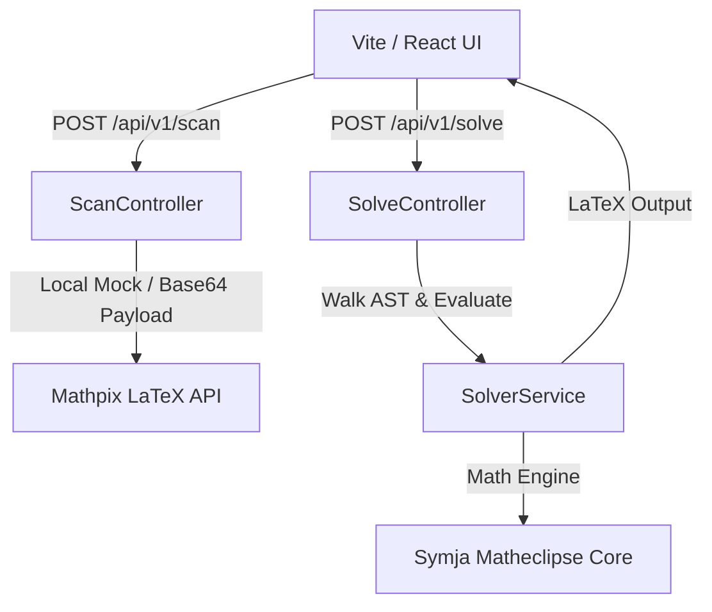

# Antigravity Math Solver (Portfolio Project)

A freelance-portfolio-grade full-stack web application that solves algebra, calculus (derivatives and integrals), and limit problems step-by-step. Users can input equations manually using a virtual mathematical keyboard or upload/scan images of equations using the built-in Mathpix OCR pipeline.

Built to enterprise engineering standards with **Spring Boot** (backend), **React + Vite** (frontend), **Symja** (algebraic math engine), and **KaTeX** (offline mathematical formula typesetting).

---

## Technical Stack & Architecture



- **Frontend**: React 19, Vite, Lucide Icons, KaTeX, Vanilla CSS (with glassmorphism, responsive grids, and customized dark theme).
- **Backend**: Spring Boot 3.3.x, Java 21/25, Maven, Spring Boot Actuator, Springdoc OpenAPI.
- **Math Solver**: Symja Core (Matheclipse) for symbolic evaluation and AST structure parsing.
- **OCR Engine**: Mathpix API (uses real endpoint when API credentials are provided; falls back to a smart mock simulator for offline testing).
- **Security**: In-memory IP-based Token Bucket rate limiting filter on API endpoints to protect OCR billing budgets, payload size limits (2MB max upload), and strict CORS mapping.

---

## Key Design Decisions

1. **Why Symja (Matheclipse) instead of basic eval?**
   Evaluating mathematical equations symbolically requires a computer algebra system (CAS) capable of parsing mathematical Abstract Syntax Trees (ASTs). Symja provides a powerful Java-based environment equivalent to Mathematica, enabling symbolic differentiation, integration, limits, and equation simplification without external Python dependencies like SymPy.

2. **Recursive Rule-Based Step Generation**:
   Symja does not natively produce pedagogical step-by-step derivations. To solve this, a recursive walk of the Symja AST was implemented (in `SolverService`). It identifies function structures (e.g. Sum, Product, Constant Multiplier, Power, Chain rule patterns) and logs mathematical derivations with correct LaTeX typesetting at each reduction step.

3. **Custom In-Memory Token Bucket Rate Limiting**:
   Rather than importing large external stateful dependencies, a clean, thread-safe, custom token bucket rate limiter (`RateLimitingFilter`) was built in pure Java to prevent API abuse, protecting backend processing threads and external Mathpix budget.

---

## API Documentation (OpenAPI/Swagger)

When the backend is running, you can explore and test the interactive APIs directly in your browser:
- **Swagger UI**: [http://localhost:8080/swagger-ui/index.html](http://localhost:8080/swagger-ui/index.html)
- **OpenAPI JSON Spec**: [http://localhost:8080/v3/api-docs](http://localhost:8080/v3/api-docs)

---

## Local Setup & Run Instructions

### 1. Prerequisites
- **Node.js**: v18+
- **Java JDK**: 21 or 25
- **Maven**: 3.9+

### 2. Run the Backend
Navigate to the `backend/` directory:
```bash
cd backend
mvn spring-boot:run
```
To run with real Mathpix API scanning, set the environment variables before starting:
```bash
export MATHPIX_APP_ID="your_app_id"
export MATHPIX_APP_KEY="your_app_key"
mvn spring-boot:run
```

### 3. Run the Frontend
Navigate to the `frontend/` directory:
```bash
cd frontend
npm install
npm run dev
```
Open [http://localhost:5173/](http://localhost:5173/) in your browser.

---

## Running the Verification Tests
To run unit and integration tests (including AST parsing, derivative rules, limits, and request validations):
```bash
cd backend
mvn test
```
*(Surefire is configured with bytebuddy flags to fully support JVM testing under Java 25.)*

---

## Production Deployment Guide

1. **Backend (Render / Railway)**:
   - Create a new project pulling from the Git repo.
   - Configure the root directory to `backend`.
   - Set Build Command: `mvn clean package -DskipTests`
   - Set Start Command: `java -jar target/calc-backend-0.0.1-SNAPSHOT.jar`
   - Configure Environment Variables: `MATHPIX_APP_ID`, `MATHPIX_APP_KEY`.

2. **Frontend (Vercel)**:
   - Connect the repo to Vercel.
   - Set the root directory to `frontend`.
   - Build Command: `npm run build`
   - Output Directory: `dist`
   - Configure proxy routes or update API target URL to production backend link in `App.jsx`.
