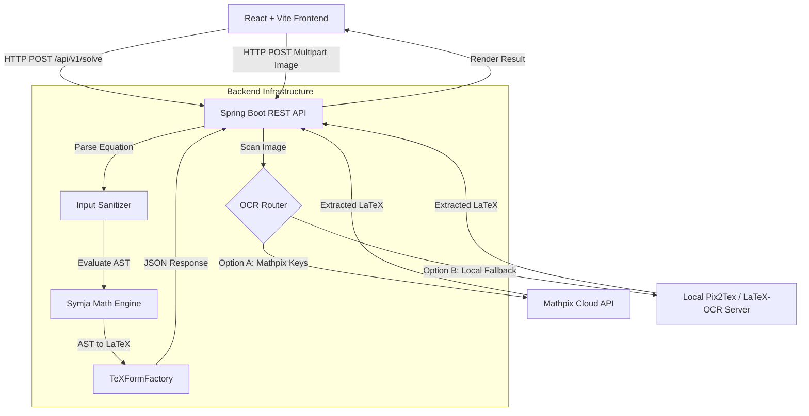

# mycalc - Advanced Computer Algebra System (CAS) & Math Solver 🚀

Welcome to **mycalc**, an advanced, full-stack mathematical solving engine. This project serves as a comprehensive Computer Algebra System (CAS) featuring a premium glassmorphic UI, a custom interactive scientific keyboard, image-based OCR equation scanning, and a robust Java-based mathematical engine capable of performing step-by-step calculus and algebraic derivations.

## 🏗 System Architecture Flow



## ⚙️ Core Technologies

- **Frontend (Vite + React)**
  - Developed with React for robust state management and Vite for optimized build performance.
  - UI styled entirely with pure CSS implementing a custom **glassmorphism** design system.
  - Uses `katex` for high-fidelity rendering of complex mathematical steps.
  - Features a custom-built 36-key interactive scientific math keyboard for tactile input.

- **Backend (Spring Boot + Java 21)**
  - Scalable REST API built with Spring Boot.
  - **Math Engine**: Integrates `matheclipse/Symja` for advanced Abstract Syntax Tree (AST) evaluation, calculus (derivatives, integrals, limits), and equation simplification.
  - Engineered with robust error handling and execution timeouts to safely handle infinitely complex or unsolvable inputs.

- **Optical Character Recognition (OCR) Engine**
  - **Primary**: Integrates with the **Mathpix API** for highly accurate image-to-LaTeX conversion, resilient to messy handwriting and mixed-text textbook photos.
  - **Secondary (Open Source Fallback)**: Capable of routing requests to a local instance of the open-source **`LaTeX-OCR` (Pix2Tex)** Python model for fully offline equation extraction.

## 🛠 Dependencies
### Frontend
- `react`, `react-dom`
- `lucide-react` (SVG Icons)
- `katex` (Mathematical typesetting)

### Backend
- `spring-boot-starter-web`
- `symja_core` (Core mathematical parsing and solver engine)

## 🚀 How to Run Locally (Docker - Recommended)
The standard and most reliable way to run the full application (Frontend + Backend + Nginx Reverse Proxy) is via Docker Compose.

1. Ensure Docker Desktop is running.
2. Clone the repository and navigate to the root directory.
3. Run the following command:
   ```bash
   docker-compose up --build
   ```
4. Access the application via `http://localhost`.

## 💻 How to Run Locally (Manual Development)
For active development on independent microservices:

### 1. Start the Spring Boot Backend
```bash
cd backend
mvn spring-boot:run
```
*The API will run on `http://localhost:8081`.*

### 2. Start the Vite React Frontend
```bash
cd frontend
npm install
npm run dev
```
*The UI will run on `http://localhost:5173` (or 5174).*

## 🔐 Environment Variables (OCR Configuration)
To enable accurate cloud-based image scanning, create a free account at [Mathpix](https://mathpix.com/) to obtain API credentials. Alternatively, if you have deployed the open-source **Pix2Tex / LaTeX-OCR** Python model to your own server, you can point the application to it.

If running via **Docker**, export them in your terminal before launching the containers:
```bash
# Option A: Mathpix (Recommended)
export MATHPIX_APP_ID="your_app_id"
export MATHPIX_APP_KEY="your_app_key"

# Option B: Custom Local/Remote Python OCR Server
export LATEX_OCR_URL="http://your-python-server-ip:8502/predict/"

docker-compose up
```
*If running manually, configure these within your system environment variables or IDE run configuration.*

## 🚀 Production Deployment (AWS EC2)
A parameterized deployment script (`deploy.sh`) is provided for deploying directly to an Ubuntu EC2 instance via SSH.
```bash
# Usage: ./deploy.sh <your_ec2_ip_address>
./deploy.sh 203.0.113.50
```
*Note: Ensure your `mycalc-key.pem` SSH key is present in the project root.*
